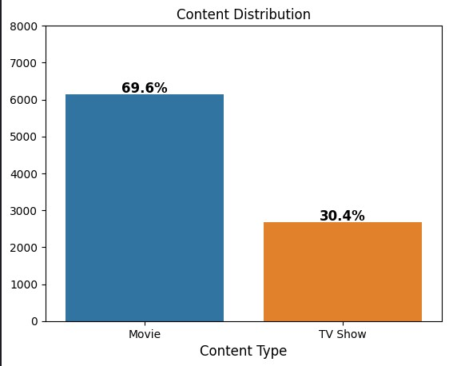
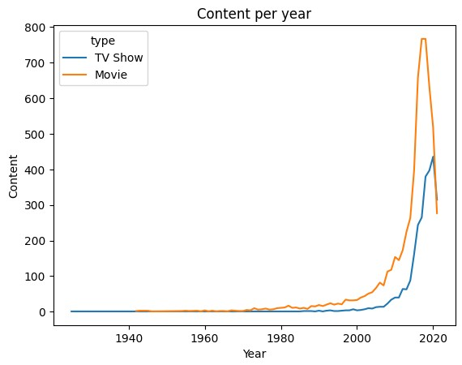
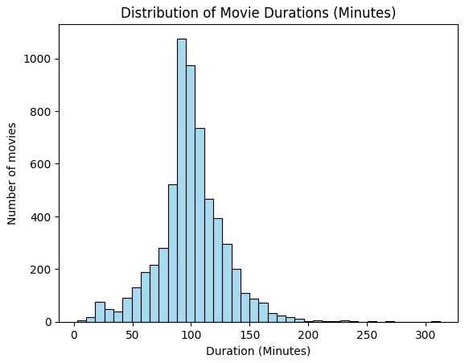
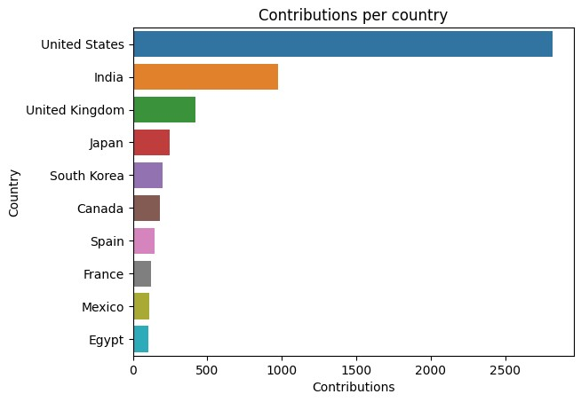
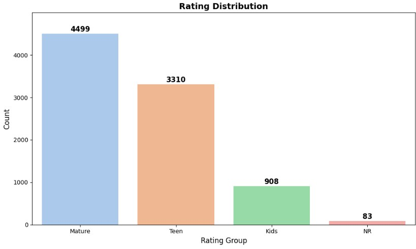

# 🎬 Netflix Data Analysis

## 📌 Overview
This project analyzes Netflix's content library using Python and data visualization tools to uncover trends, patterns, and key insights.  
The dataset includes information about movies and TV shows — such as **title, director, cast, country, release year, rating, duration**, and **genres**.

---

## 🛠️ Tools & Technologies

**Python Libraries**
- `pandas` → data manipulation  
- `numpy` → numerical operations  
- `matplotlib`, `seaborn` → data visualizations  
- `Jupyter Notebook` → interactive analysis  

**Dataset**  
- **Netflix Movies and TV Shows** (CSV format)  
- Sourced from **[Kaggle](https://www.kaggle.com/datasets/ankulsharma150/netflix-data-analysis)**

---

## 📊 Key Insights

### 1. Content Distribution  
- **Movies:** 69.6%  
- **TV Shows:** 30.4%

### 2. Content Growth Over Time  
- Surge in content production post-2000s.

### 3. Duration Analysis  
- **Movies:** Avg. duration ≈ **99.58 minutes**  
- **TV Shows:** ~**67%** have only **1 season**

### 4. Top Contributors  
- **Countries:** US > India > UK > Japan > South Korea  
- **Director:** *Rajiv Chilaka* (most titles on the platform)

### 5. Rating Trends  
- **Mature Audience:** 51.12%  
- **Teen Audience:** 32.5%  
- **Kids Content:** 16.38%

---

## 📂 Files
- `Netflix_Data_Analysis.ipynb` → Full Jupyter notebook analysis  
- [`netflix_movies (1).csv`](https://raw.githubusercontent.com/ss-rajan/Netflix_analysis/refs/heads/main/netflix_movies%20(1).csv) → Dataset (raw CSV from GitHub)

---

## 🎯 Conclusions
Netflix's library highlights:
- A **dominance of movies** over TV shows  
- **Exponential growth** in content post-2000  
- A strong **focus on mature audiences**  
- Major contributions from the **U.S. and India**

> 📈 *This analysis offers valuable insight into how Netflix curates its platform for a global and growing audience.*

---

## 🔗 Resources
- [Dataset on Kaggle](https://www.kaggle.com/datasets/shivamb/netflix-shows)  
- [TV Ratings Explained](https://www.tvguidelines.org/)  

---
